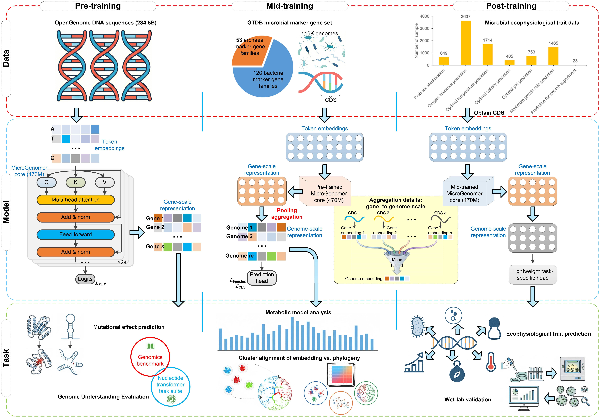

# MicroGenomer: A Foundation Model for Transferable Microbial Genome Representations Enabling Multi-scale Genomic Understanding and Ecophysiological Trait Prediction
## Introduction
MicroGenomer is a foundation model for transferable microbial genome representations, enabling multi-scale genomic comprehension and ecophysiological trait prediction. It adopts a hierarchical training strategy that integrates large-scale genomic sequence pre-training (234.5 billion base pairs), domain-specific mid-training with the GTDB-curated marker gene set, and task-specific post-training. Surpassing existing gene-scale encoders, MicroGenomer generates robust embeddings at the whole-genome scale.

## Schematic Diagram
<div style="text-align: center;">
    
</div>
Figure 1. Overview of MicroGenomer.

## Quick Start
### Download the GitHub Repository
[Download](https://github.com/BGIResearch/MicroGenomer/archive/refs/heads/main.zip) the GitHub repository and extract the files to a designated folder.

### Data Description
The input data required for MicroGenomer model inference and genomic representation extraction is formatted as a comma-separated values (CSV) file, which exclusively contains gene sequences with annotated Coding Sequences (CDS) — the core genomic regions that encode functional proteins in microbial genomes. The input data format is as follows:
- `genome_id`: Unique identifier for the current genome
- `aa_seq`: DNA sequence corresponding to CDS in the current genome
- `unique_id`: Unique ID for identifying the DNA sequence

Example:
```csv
unique_id,aa_seq,genome_id
RS_GCF_013393365.1@TIGR00168,TTGCCGTCCGTAG...GTAGTAAATAA,RS_GCF_013393365.1
RS_GCF_013393365.1@TIGR00382,TTGGCAAAAGATA...TGAAATCGTAA,RS_GCF_013393365.1
...
```

## Installation
```bash
# Create a Conda Python environment
conda create -n MicroGenomer python=3.10
conda activate MicroGenomer
git clone https://github.com/BGIResearch/MicroGenomer.git
cd MicroGenomer
pip install -r requirements.txt
```

## Usage
### Foundation Model Weights
* Download the weights for [MicroGenomer](https://huggingface.co/sunhaotong0605/MicroGenomer-470M/tree/main).
* Place the `backbone`, `checkpoint` and `downstream_tasks` folders in the `weights/` directory.

### Run Inference for Different Downstream Tasks
Five downstream tasks available: maximum growth rate, oxygen tolerance, salinity tolerance, optimal pH, and optimal temperature.
```bash
bash run.sh \
    '/path/to/input/' \
    '/path/to/output/' \
    [downstream_task] \ # Options: test_growth, test_oxygen, test_salinity, test_pH, test_temperature, or none
```
* 1st positional argument: Path to the input file/folder.
* 2nd positional argument: Path for saving output files.
* 3rd positional argument: Downstream task option.

The input path can be a single CSV file or a folder. If it is a folder, all CSV files within that folder will be processed in batch. If the 3rd positional argument is left empty, the model will only extract genomic representations without executing specific downstream tasks.

### Docker Deployment
* First, pull the Docker image:
```bash
docker pull sunhaotong0605/microgenomer:1.0
```
* Run Inference for Different Downstream Tasks:
```bash
docker run --rm --gpus all \
    -v /path/to/input/:/data/input \
    -v /path/to/output/:/data/output \
    -e INPUT_PATH="/data/input" \
    -e OUTPUT_PATH="/data/output" \
    sunhaotong0605/microgenomer:1.0 \
    sh -c 'bash start.sh $INPUT_PATH $OUTPUT_PATH test_growth'
```
Please replace `/path/to/input/`, `/path/to/output/`, and the downstream task option(e.g., `test_growth`) with your actual paths and desired task.

## License
This project is licensed under the MIT License. See [LICENSE](LICENSE) for more details.

## Citation
Kang Q, Guo Y, Hu B, et al. MicroGenomer: A Foundation Model for Transferable Microbial Genome Representations Enabling Multi-scale Genomic Understanding and Ecophysiological Trait Prediction. bioRxiv. doi: https://doi.org/10.64898/2025.12.28.696777.
